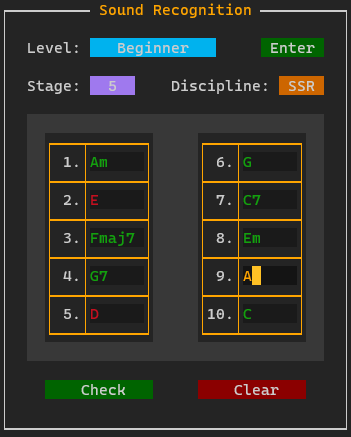

# blessed_widgets

## Introduction

A purely Python library which implements high-level widgets using [blessed](https://github.com/jquast/blessed).

This library takes focus on being easy to use and fast to deploy.
It's purpose is to give relatively simple applications a visual interface.

It has all the capabilities as [blessed](https://github.com/jquast/blessed), but with the rigorous work of creating and managing widgets abstracted away. For the full documentation visit the Repository Wiki.

---

## Example
### Sound Recognition

Application for pitch training in: 
1. Sound Quality Recognition
2. Single Sound Recognition
3. Chord Progression Recognition.

Based around [Justin Guitar's Course](https://www.justinguitar.com/).

, and other examples can be found in the `./examples/` folder.

---

### Motivation

Maybe your **CLI** application could improve with some visuals?
It could make it easier for others to use by labeling input fields, or showing the available options with a dropdown menu.

Maybe building an entire **GUI** for your simple subtitle arranger application is not worth the hastle, but you still want the functionality of buttons and entry fields.

I was inspired to make this library because I wanted to make an application for sound-recognition for hearing/pitch training. 
A **CLI** wouldn't make it clear at which stage/discipline I was, nor in which way would I have to input the fields. Meanwhile to have a good looking **GUI** application is too much hastle for such a simple purpose. A **TUI** seemed like the perfect middle.

### Comparison with other Interfaces

1. If the application has a high ammount of widgets then resolution and navigation becomes a problem, and a **GUI** would be preferred.
2. If the application needs to be used frequently with a large ammount of input from the user and has little to no graphical elements a **CLI** would be preferred.
